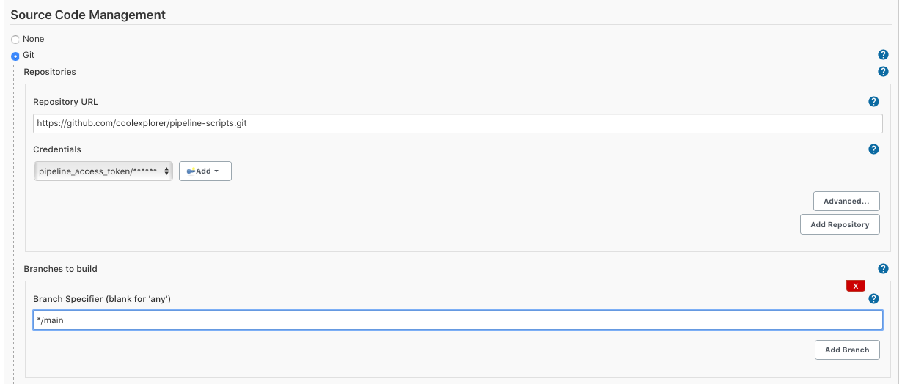

# Jenkins pipeline

## Jenkins pipeline Setting

To use the pipeline in Jenkins, there are several plugins. In this project, I'm going to use Job DSL to build the Jenkins jobs as a code. 

## Prerequsites
1. Install plugins
   * Pipeline (including Pipeline:Groovy, Pipeline: Shared Groovy Libraries)
    
   * Job DSL : To build Job DSL script
   * Git plugin
   * Kubernetes plugin
   * Sectioned View : To creat section view
   * Build Blocker

2. Security option
   You will see error related to the security when you build Job DSL scripts. You can allow them one by one after checking in `Manage Jenkins > Security > In-process Script Approval`

   However, in this example, I'm going to use the simple option to disable this issue. 
   Enter to `Manage Jenkins > Security > Configure Global Security > CSRF Protection` and disable `Enable script security for Job DSL scripts`
   

   > Keep in mind this option can be seen after v1.6.0

## Job DSL build Job Creation
If you make your jobs using Job DSL, you can make them just one click using Job DSL build job. 

1. Create Freestyle job - `New Item > Freestyle project`
2. Add `Source code Management`. Connect this repository.
   * Add repository information.
    
   * Add `Process Job DSLs` in `Build` Tab with the script path.
    

## Run Job DSL build job

1. Build Job and see the success result.
   

2. Check the View and jobs you've added.
   
