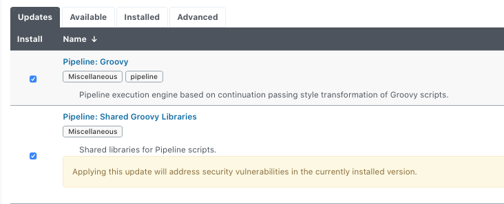

# Jenkins pipeline

## Jenkins pipeline Setting

To use the pipeline in Jenkins, there are several plugins. In this project, I'm going to use Job DSL to build the Jenkins jobs as a code. 

## Prerequsites
1. Install plugins
   * Pipeline (including Pipeline:Groovy, Pipeline: Shared Groovy Libraries).   
    
   * Job DSL : To build Job DSL script
   * Git plugin
   * Kubernetes plugin
   * Sectioned View : To creat section view
   * Build Blocker
   * Workspace Cleanup

2. Security option
   You will see error related to the security when you build Job DSL scripts. You can allow them one by one after checking in `Manage Jenkins > Security > In-process Script Approval`
   However, in this example, I'm going to use the simple option to disable this issue. 
   Enter to `Manage Jenkins > Security > Configure Global Security > CSRF Protection` and disable `Enable script security for Job DSL scripts`.   
   

   > Keep in mind this option can be seen after v1.6.0

## Examples
|        Category          |         Example          |
|--------------------------|--------------------------|
| Set up the Job DSL       | [Create Job DSL build Job](docs/create-job-dsl-build.md) |
| Job DLS structure        | [Create simple pipeline job](docs/create-simple-pipeline.md) | 
| Jenkins Agent            | [Kubernetes dynamic agent provisioning](docs/k8s-pod-template.md) |
| Pipeline examples        | [Gatling Test Job - Declarative pipeline](docs/gatling-test-job-declarative.md) |
|                          | [Gatling Test Job with docker container](docs/gatling-test-job-with-docker.md) |