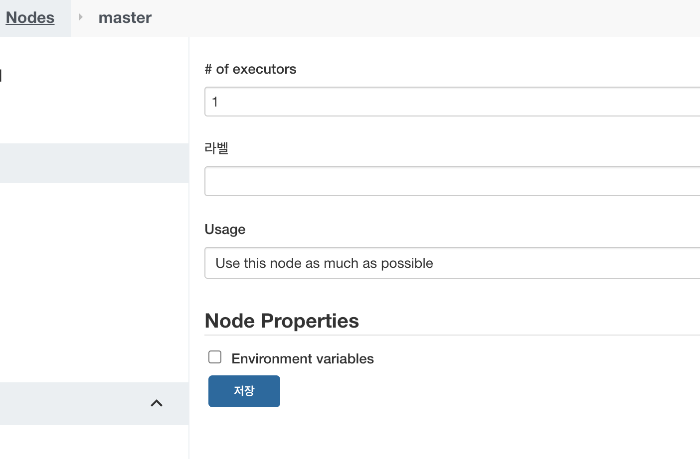
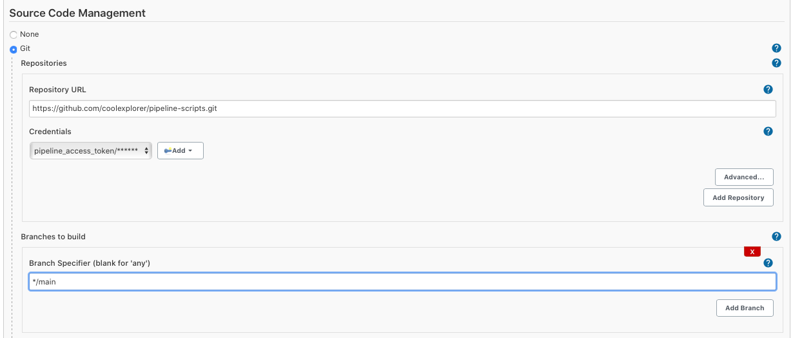
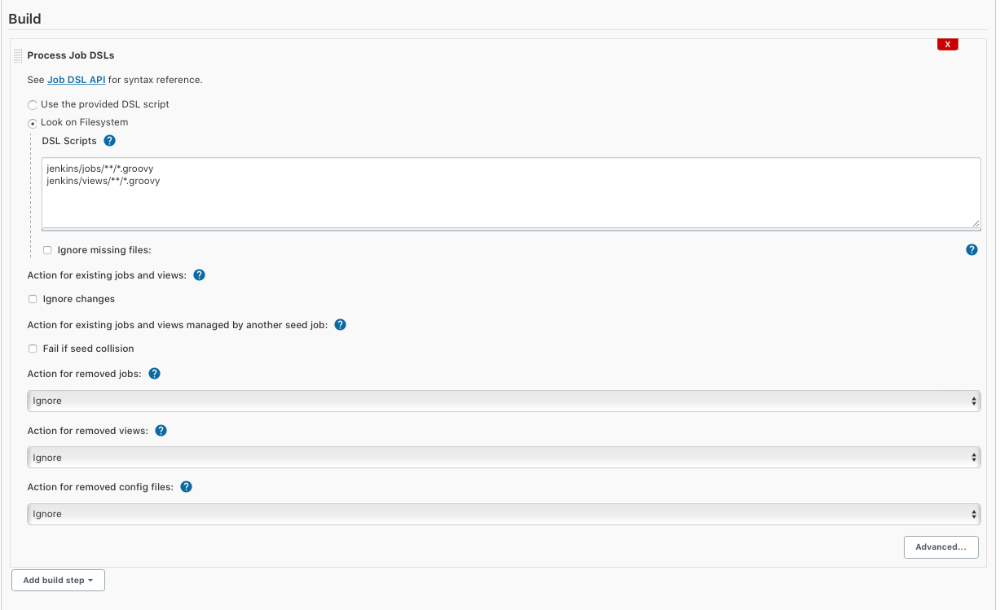
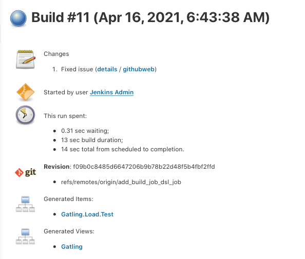
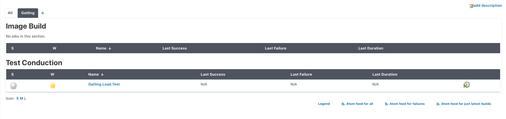
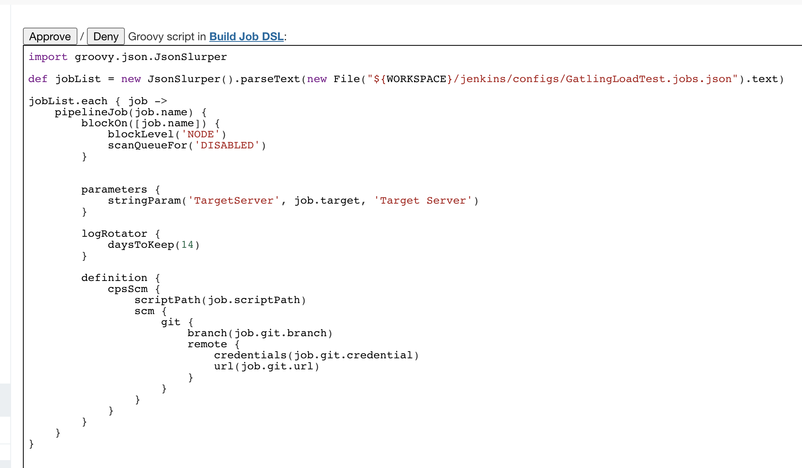

# Job DSL build Job 

## Prerequisites
In my environment, basically running in the kubernetes and will use `pod template` to make slave agents for running our pipeline scripts. 
However, Job DSL build must use the executor in the master node so that they can make the job on the master environment. Jenkins will create the pod template if your master do not have the executor. (Default is 0) Please check the count `1` and run the job. 



## Job creation

If you make your jobs using Job DSL, you can make them just one click using Job DSL build job. 

1. Create Freestyle job - `New Item > Freestyle project`
2. Add `Source code Management`. Connect this repository.
   * Add repository information  
    
   * Add `Process Job DSLs` in `Build` Tab with the script path  
    

## Run Job DSL build job

1. Build Job and see the success result.  
   

2. Check the View and jobs you've added.  
   

## Trouble shooting

1. `ERROR: script not yet approved for use`
   * Error logs
   ```console
   Warning: Plugins have been installed without restarting Jenkins. A restart is required to run Job DSL without any problems.
   Processing DSL script jenkins/jobs/GatlingLoadTest.groovy
   ERROR: script not yet approved for use
   Finished: FAILURE
   ```
   * Solution
   `Jenkins manage` > `In-process Script Approral` > `Approve`
   
   
2. `No such file or directory`
   Make sure do not insert `space` or `.` for the job name of Building Job DSL. In the Job DSL file, calling the config file by the path and those special characters make an issue whenever this script is built. Normally, use `Build_Job_DSL`.


