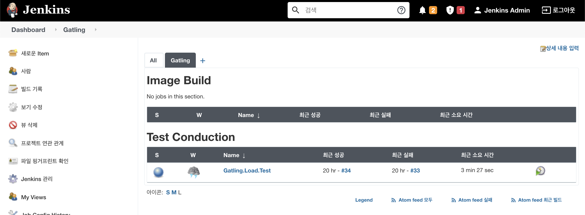

# Gatling test job 

This document describes the pipeline script to run the load test script made by Gatling which is the load test(Performance test) tool. Gatling is a popular tool to check the server's reliability and availability. 
Please refer this [repository](https://github.com/coolexplorer/maven-gatling). 

## Structure

I will have 4 files to set up the job. - Configuration, Job, Pipeline, and View. 

This scripts are built by [Build Job DSL](create-job-dsl-build.md) and finally we will see below jobs and a view. 


```console
jenkins
├── configs
│   └── GatlingLoadTestJobs.json
├── jobs
│   └── GatlingLoadTest.groovy
├── pipelines
│   └── GatlingLoadTest.groovy
└── views
    └── GatlingView.groovy
```

### Configuration
`configs/GatlingLoadTestJobs.json`

This configuration is the data for the job I create. This insists of Job name, SCM definition and default values of paremters. 

```json
[
  {
    "name": "Gatling.Load.Test",
    "scriptPath": "jenkins/pipelines/GatlingLoadTest.groovy",
    "git": {
      "url": "https://github.com/coolexplorer/pipeline-scripts.git",
      "branch": "*/Add_build_job_dsl_job",
      "credential": "pipeilne_access_token"
    },
    "branch": "main"
  }
]
```
### Job DSL
`jobs/GatlingLoadTest.groovy`

This file describes how I will create the job. Parameters, SCM Definition, and various options. 

```groovy
import groovy.json.JsonSlurper

// Get the job configuration from the json file
def jobList = new JsonSlurper().parseText(new File("${WORKSPACE}/jenkins/configs/GatlingLoadTestJobs.json").text)

jobList.each { job ->
    pipelineJob(job.name) {
        // block - Only one job can be run at the same time.
        blockOn([job.name]) {
            blockLevel('NODE')
            scanQueueFor('DISABLED')
        }

        // Parameter definitions
        parameters {
            stringParam('TargetServer', job.target, 'Target Server')
            stringParam('Branch', job.branch, 'Source Branch')
        }

        // Log rotator
        logRotator {
            daysToKeep(14)
        }

        // SCM Definition
        definition {
            cpsScm {
                scriptPath(job.scriptPath)
                scm {
                    git {
                        branch(job.git.branch)
                        remote {
                            credentials(job.git.credential)
                            url(job.git.url)
                        }
                    }
                }
            }
        }
    }
}
```

### Declarative Pipeline version
`pipelines/GalingLoadTest.groovy`

This script is for actual actions in the pipeline. There are the agent definition and stages for our purpose. In this script, there are 5 stages - `Clone source`, `Initialization`, `Run`, `Report generation`, `Report publishment`.

```groovy
#!/usr/bin/env groovy

def reportPath = "target/gatling/report"
def resultPath = "target/gatling"

pipeline {
    agent {
        kubernetes {
            yamlFile 'jenkins/agent/k8s/maven.yaml'
        }
    }

    stages {
        stage('Clone the source') {
            steps {
                checkout([$class: 'GitSCM',
                        branches: [[name: "*/${params.Branch}"]],
                        doGenerateSubmoduleConfigurations: false,
                        extensions: [[$class: 'RelativeTargetDirectory', relativeTargetDir: 'maven-gatling']],
                        submoduleCfg: [],
                        userRemoteConfigs: [[credentialsId: 'pipeline_access_token', url: 'https://github.com/coolexplorer/maven-gatling.git']]]
                )
            }
        }

        stage('Initialize Gatling test') {
            steps {
                container('maven') {
                    dir('maven-gatling') {
                        sh "mkdir -p ${reportPath}"
                    }
                }
            }
        }

        stage('Run Gatling test') {
            steps {
                container('maven') {
                    dir('maven-gatling') {
                        sh 'mvn gatling:test -Dgatling.noReports=true'
                    }
                }
            }
        }

        stage('Generate Gatling report') {
            steps {
                container('maven') {
                    dir('maven-gatling') {
                        script {
                            def simulationPath = sh script: "ls -l ${resultPath} | grep loadtestsimulation | awk '{print \$9}'", returnStdout: true

                            sh "cp ${resultPath}/${simulationPath.trim()}/simulation.log ${reportPath}/simulation.log"

                            sh 'mvn gatling:test -Dgatling.reportsOnly=report'
                        }
                    }
                }
            }
        }

        stage('Publish gatling report') {
            steps {
                container('maven') {
                    dir('maven-gatling') {
                        publishHTML target: [
                            allowMissing: false,
                            alwaysLinkToLastBuild: false,
                            keepAll: true,
                            reportDir: "${reportPath}",
                            reportFiles: 'index.html',
                            reportName: 'Gatlinge report'
                        ]
                    }
                }
            }
        }
    }
}
```