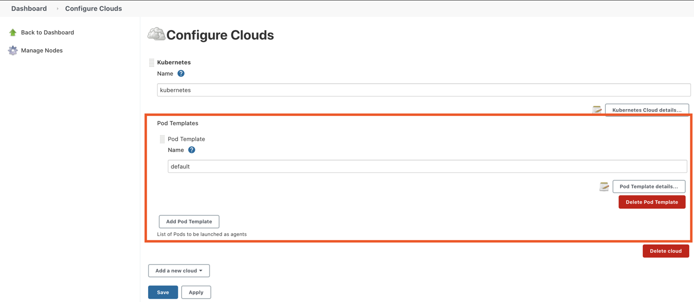

# Kubernetes dynamic agent via Pod template

If you operate your Jenkins in the Kubernetes, you can make agent dynamically via Pod. Pods are the smallest deployable units of computing that you can create and manage in Kubernetes. You can see the details on this [link](https://kubernetes.io/docs/concepts/workloads/pods/).

Pods in Kubernetes can run multicontainer simultaneously, which is a good option making our agent. For example, you just run the container added on `docker` or `maven` if you want to use them. 

## Prerequisites
1. Install plugins - Kubernetes Plugin
2. Jenkins pod in Kuberenetes is needed to have a permision to create pods. 
   * Need to add a service account with RBAC (Role Based Access Control)
   * Refer to my repository, k8s-chart, there is the way to install Jenkins with a servcie account. Make sure to check below values in `values.yaml` file.
    ```yaml
    serviceAccount:
        create: true
    ```
    > If you get the official helm chart from Jenkins, above option is default. 

## Pipeline script with Dynamic agent

OK. You have the environment to make container based Agent in Kubernetes. Let's see how you can make Pipeline scripts with this agent.

### What we are going to do?
For simple example, we are going to see the maven version with `mvn -version` command. 

To create the agent, we need to define the pod we will use. There are various options to define this. 

First, we can use the predefined agent configured in the Clouds configuration like below.   


In this case, you just add the name(`maven`) into the your pipeline script. 
```groovy
pipeline {
  agent {
    kubernetes {
      defaultContainer 'maven'
    }
  }
...
```

Second, you can define directly inside the script. 
```groovy
pipeline {
    agent {
        kubernetes {
        yaml """\
            apiVersion: v1
            kind: Pod
            metadata:
            labels:
                some-label: some-label-value
            spec:
            containers:
            - name: maven
                image: maven:alpine
                command:
                - cat
                tty: true
            """.stripIndent()
        }
    }
...
}
```

Last but not least, you can include the yaml file you created. 
```groovy
pipeline {
    agent {
        kubernetes {
        yamlFile 'KubernetesPod.yaml'
        }
    }
    stages {
        stage('Run maven version') {
            steps {
                container('maven') {
                    sh 'mvn -version'
                }
            }
        }
    }
}
```

